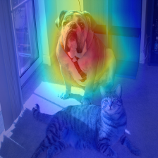
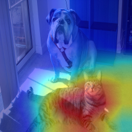
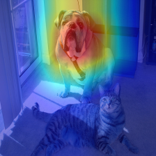

# Grad-CAM with PyTorch

PyTorch implementation of [Grad-CAM (Gradient-weighted Class Activation Mapping) [1]](https://arxiv.org/pdf/1610.02391v1.pdf). Grad-CAM localizes and highlights the discriminative regions that Convolutional Neural Networks-based models activate to predict visual concepts. This code contains only an implementation for the ResNet-152 image classification models.

## Dependencies
* Python 2.7
* PyTorch
* torchvision

## Usage
```bash
$ python main.py --image samples/cat_dog.jpg [--no-cuda]
```
This generates, for top 3 categories:
* Vanilla backproped gradients
* Guided backproped gradients
* Grad-CAM
* Guided Grad-CAM

## Examples


||bull mastiff|tiger cat|boxer|
|:-:|:-:|:-:|:-:|
|Probability|0.54285|0.19302|0.10428|
|Grad-CAM [1]||||
|Vanilla Backpropagation||||
|Guided Backpropagation [2]||||
|Guided Grad-CAM [1]||||

## References
\[1\] R. R. Selvaraju, A. Das, R. Vedantam, M. Cogswell, D. Parikh, and D. Batra. "Grad-CAM: Visual Explanations from Deep Networks via Gradient-based Localization". arXiv, 2016<br>
\[2\] J. T. Springenberg, A. Dosovitskiy, T. Brox, and M. Riedmiller. "Striving for Simplicity: The All Convolutional Net". arXiv, 2014